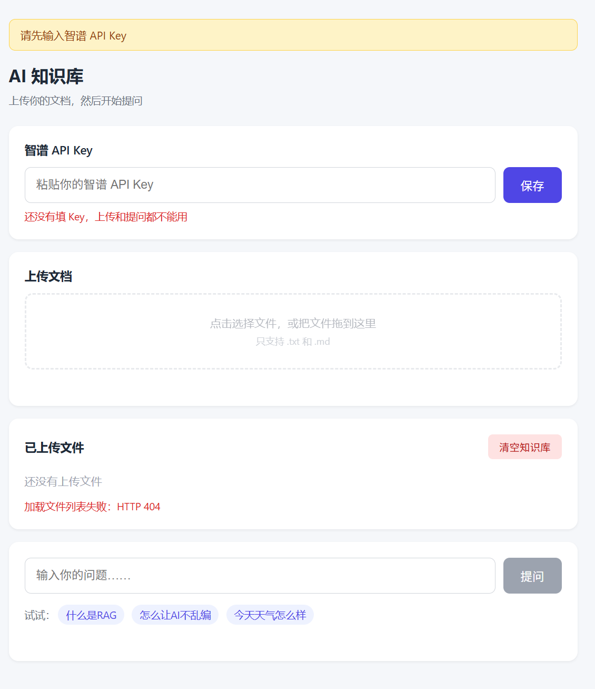

# 基于RAG的AI知识库问答系统

一个用 FastAPI + LangChain + Chroma + 智谱 搭建的极简 RAG 问答项目。  
把合法采集的文本，变成一个可以提问、能溯源、不瞎编的知识库接口，并带一个极简前端页面。

Embedding 和生成回答都用智谱（`embedding-2` + `glm-4-flash`），一把 Key 搞定。  
**API Key 不放在后端**，由你在网页上输入，存在浏览器里。



 
---

## 一、这是什么

RAG = 检索增强生成。  
通俗说：先查资料，再让 AI 回答，减少瞎编。

这个项目的流程：

用户提问
→ 前端页面（带上 X-Zhipu-Key 请求头）
→ FastAPI 接收
→ LangChain 检索器去向量库找相关段落
→ 拼成资料
→ 发给智谱 glm 生成回答
→ 返回答案和来源
→ 前端显示

---

## 二、项目结构

RAG-Knowledge-Base/
  main.py              # FastAPI 入口：/ask + 上传/列表/删除/清空，托管前端
  rag.py               # RAG 链，检索 + 生成
  embeddings.py        # 智谱 Embedding 封装，供 LangChain 使用
  ingest.py            # 上传处理：读取 → 切分 → 打 metadata → 分批入库
  vector.py            # 建向量库：读 notes.txt → 切分 → 存 Chroma
  search.py            # 单独测试向量检索
  test_post.py         # 测试 POST /ask 接口
  static/
    index.html         # 极简前端页面（单文件，内联CSS和JS）
  data/
    uploads/           # 网页上传的原始文件
    knowledge/
      notes.txt        # 知识库原文（种子数据）
    chroma_db/         # Chroma 向量库（本地持久化）
    key_fingerprint.txt  # 只存 Key 的 SHA256 前 8 位，用来判断有没有换 Key
  notes/               # 学习笔记
  README.md            # 项目说明

---

## 三、依赖

- Python 3.10+
- FastAPI：提供接口
- python-multipart：接收上传文件，缺了它 `/upload` 会直接报错
- LangChain：串联检索和生成
- Chroma：本地向量库
- 智谱：Embedding（`embedding-2`）+ 生成回答（`glm-4-flash`），一把 Key 全包

---

## 四、环境准备

### 1. 安装依赖

```bash
pip install fastapi "uvicorn[standard]" python-multipart zhipuai chromadb langchain langchain-community langchain-chroma langchain-text-splitters
```

### 2. 准备智谱 API Key

**不用配 `.env`，也不用改代码。** 启动服务后打开网页，在页面最上方的
“智谱 API Key”卡片里把 Key 粘进去，点“保存”就行。

- Key 存在你自己浏览器的 `localStorage` 里，后端不落盘、不写日志。
- 页面上只显示前 4 位，不会把完整 Key 显示出来。
- 智谱 Key 在这里申请：https://open.bigmodel.cn

Embedding 和生成回答都用智谱，一把 Key 就够了。

### 3. 准备知识库文本

两种方式，任选：

- **网页上传**（推荐，日常就用这个）：启动后在页面上传 `.txt` / `.md` 文件。
- **改种子文件**：编辑 `data/knowledge/notes.txt`，一行一条，再跑一次 `python vector.py`。

不管哪种，都只用公开、合规、你有权使用的文本。

---

## 五、使用步骤

### 先启动服务

```bash
cd /d D:\...\RAG-Knowledge-Base
python main.py
```

或者：

```bash
python -m uvicorn main:app --reload
```

看到：

```text
Uvicorn running on http://127.0.0.1:8000
```

就成功了。

### 第一步：输入智谱 Key

浏览器打开：

```text
http://127.0.0.1:8000/
```

页面最上方是“智谱 API Key”卡片，把 Key 粘进密码框，点“保存”。

- 保存后显示“已保存 Key（前4位：xxxx...）”，**不会显示完整 Key**。
- Key 存在浏览器 `localStorage`，下次打开页面自动填回来，不用重输。
- **没填 Key 之前，上传和提问都是禁用的**，页面顶部会提示“请先输入智谱 API Key”。
- Key 填错了会提示“API Key 无效，请检查”。

### 第二步：上传文档

在上传区选一个 `.txt` 或 `.md` 文件，或者直接拖进去。上传时会显示“上传中……”，
完成后文件列表自动刷新。

关于大小：

**上传没有文件大小限制**，只限制文件类型（`.txt` / `.md`）。
一个几 MB 的纯文本可以正常传上去。

但要注意，文件越大会越慢：入库时要把文本切成块，一块块送给智谱做 Embedding
（单次请求最多 64 块，程序会自动分批），所以大文件的上传时间大致和文件大小成正比。
实测 100KB 约 5 秒、1MB 约 50 秒、5MB 大概几分钟。等的时候页面会一直显示“上传中……”，
别关页面就行。

### 第三步：提问

在下面输入框里提问，或者点示例问题。回答和来源显示在下方，支持回车提交，
加载中会禁用按钮。页面从上到下就是三块：上传文档、已上传文件、提问。

原来的 `/docs` 依然可以访问，用来调试接口。

### 第四步：删除 / 清空

- **删除单个文件** —— 文件列表里每行右边有“删除”，点一下会二次确认。删掉的同时，
  它在向量库里的 chunk 也一起删，别的文件不受影响。
- **清空知识库** —— 右下角（文件列表右上角）的“清空知识库”，二次确认后删掉所有文件
  并清空整个向量库。

### （可选）用 notes.txt 做首次初始化

`data/knowledge/notes.txt` 作为种子保留着。想让它的内容一开始就在知识库里：

```bash
python vector.py
```

会提示你输入智谱 Key（命令行里输，不回显）。看到
`已把 data/knowledge/notes.txt 初始化进向量库，共 N 块` 就成功了。  
文件不存在也不会报错，只会提示跳过。

> 注意：这样入库的 chunk，`source` 是 `notes.txt`，不在 `data/uploads/` 里，
> 所以**不会出现在网页的文件列表里**，只能靠“清空知识库”连带清掉。

### （可选）测试检索

```bash
python search.py
```

同样会先让你输入 Key。检索用的 Key 必须和当初入库用的是同一把，否则结果没有意义。

---

## 六、接口说明

### 先说请求头

**凡是会调用智谱的接口，都要带 `X-Zhipu-Key` 请求头**，值是你的智谱 Key：

```text
X-Zhipu-Key: 你的智谱 Key
```

需要带头的接口：`GET /ask`、`POST /ask`、`POST /upload`、
`DELETE /files/{filename}`、`DELETE /files`。

不用带的：`GET /files`（只读本地目录，不调智谱）、`/`、`/docs`。

没带或带了空的 → 401：

```json
{"detail": "请先输入智谱 API Key"}
```

Key 不对 → 401：

```json
{"detail": "API Key 无效"}
```

额度不足 → 403：

```json
{"detail": "智谱账户额度不足，请检查余额"}
```

### GET /ask

方便命令行直接测（要带请求头）：

```bash
curl -H "X-Zhipu-Key: 你的智谱Key" "http://127.0.0.1:8000/ask?q=什么是RAG"
```

返回：

```json
{
  "question": "什么是RAG",
  "answer": "RAG是检索增强生成，先查资料再让AI回答。",
  "sources": ["RAG 是检索增强生成，先查资料再让 AI 回答。"]
}
```

### POST /ask

前端页面实际调用的就是这个接口，参数放请求体里：

```bash
curl -X POST http://127.0.0.1:8000/ask \
  -H "Content-Type: application/json" \
  -H "X-Zhipu-Key: 你的智谱Key" \
  -d "{\"question\": \"什么是RAG\"}"
```

或用 `test_post.py`（会先让你输入 Key）：

```bash
python test_post.py
```

### 资料里没有的问题

```bash
curl -H "X-Zhipu-Key: 你的智谱Key" "http://127.0.0.1:8000/ask?q=今天天气怎么样"
```

会返回：

```json
{
  "question": "今天天气怎么样",
  "answer": "资料中没有提到。",
  "sources": []
}
```

这叫**约束幻觉**：让 AI 别编。

### POST /upload

上传一个文件，`multipart/form-data`，字段名 `file`。只收 `.txt` 和 `.md`。

```bash
curl -X POST http://127.0.0.1:8000/upload \
  -H "X-Zhipu-Key: 你的智谱Key" \
  -F "file=@A.txt"
```

成功返回：

```json
{
  "filename": "A.txt",
  "chunks": 12,
  "message": "上传成功"
}
```

同名文件再传一次会先删掉旧向量、再覆盖原文件重新入库，不会重复也不会残留。  
**没有文件大小限制**，只校验扩展名，格式不对返回 400：

```json
{"detail": "只支持 .txt 和 .md 文件"}
```

如果知识库里已经有向量、而这次用的 Key 和当初入库的不是同一把，会返回 409：

```json
{"detail": "Key 已更换，请先点「清空知识库」，再重新上传"}
```

### GET /files

列出 `data/uploads/` 里已上传的文件：

```json
{
  "files": [
    {"filename": "A.txt", "size": 1234, "upload_time": "2026-10-02 12:00:00"}
  ]
}
```

`size` 是字节数，`upload_time` 取文件修改时间。

### DELETE /files/{filename}

删掉一个文件，同时删掉它在向量库里的所有 chunk（只删这个文件的，别的文件不受影响）：

```bash
curl -X DELETE http://127.0.0.1:8000/files/A.txt \
  -H "X-Zhipu-Key: 你的智谱Key"
```

```json
{"message": "已删除 A.txt"}
```

文件不存在返回 404。

删除不校验 Key 指纹——删东西不需要算 Embedding，换过 Key 也应该删得掉。

### DELETE /files

清空知识库：删掉 `data/uploads/` 里所有文件，清空整个向量库集合，
并把 Key 指纹一起删掉（也就是解绑）。

```bash
curl -X DELETE http://127.0.0.1:8000/files \
  -H "X-Zhipu-Key: 你的智谱Key"
```

```json
{"message": "知识库已清空"}
```

同样不校验指纹——**这正是你换了 Key 之后该走的补救路径**：先清空，再用新 Key 重新上传。

### Key 和向量库的关系（重要）

Embedding 是拿 Key 算出来的，**换一把 Key 就是换了一套坐标系**，旧向量和新问题对不上。

所以后端在 `data/key_fingerprint.txt` 里存了一份 Key 的 **SHA256 前 8 位**
（只有哈希，没有明文，也反推不出 Key）。上传和提问时比对：

- 没换 Key → 正常检索。
- 换了 Key → 拒绝检索，返回 409：

```json
{"detail": "Key 已更换，请重新上传知识库"}
```

处理办法：点“清空知识库”，再用新 Key 重新上传所有文件。

---

## 七、每个文件做什么

| 文件 | 作用 |
|---|---|
| `main.py` | FastAPI 入口，`/ask` + 上传/列表/删除/清空，取 `X-Zhipu-Key`，托管前端页面 |
| `rag.py` | RAG 链，检索 + 生成；按 Key 现建向量库；读写 Key 指纹 |
| `embeddings.py` | 智谱 Embedding 封装，接收 `api_key` 参数 |
| `ingest.py` | 上传处理：读取、切分、打 metadata、分批入库 |
| `vector.py` | 建向量库（命令行会问你要 Key） |
| `search.py` | 单独测试向量检索（同样会问 Key） |
| `test_post.py` | 测试 POST 接口（同样会问 Key） |
| `static/index.html` | 极简前端页面，单文件，内联 CSS 和 JS；Key 输入框在这里 |
| `data/uploads/` | 网页上传的原始文件 |
| `data/knowledge/notes.txt` | 知识库原文（种子数据） |
| `data/chroma_db/` | 向量库文件 |
| `data/key_fingerprint.txt` | Key 的 SHA256 前 8 位，判断有没有换 Key |
| `notes/` | 学习笔记 |

---

## 八、常见问题

**Q：`ModuleNotFoundError: No module named 'xxx'`**  
A：没装依赖，跑一次安装命令。

**Q：没填 Key 会怎样？**  
A：上传和提问按钮是禁用的，页面顶部提示“请先输入智谱 API Key”。
真绕过界面直接打接口，后端也返回 401 `{"detail": "请先输入智谱 API Key"}`。

**Q：提示“API Key 无效，请检查”**  
A：Key 不对或者过期了。到 https://open.bigmodel.cn 重新复制一把，
粘回页面顶部的输入框点“保存”。注意别把前后空格带进去。

**Q：换了 Key 之后，提问提示“Key 已更换，请重新上传知识库”**  
A：这是故意的。向量是用旧 Key 算出来的，换 Key 后两套坐标系对不上，检索结果没意义。
处理办法：点“清空知识库”，再用新 Key 重新上传所有文件。
（清空会顺便删掉 `data/key_fingerprint.txt`，也就是解绑。）

**Q：Key 存在哪？会不会被后端存下来？**  
A：只存在你自己浏览器的 `localStorage` 里（键名 `zhipu_api_key`）。
每次请求放在 `X-Zhipu-Key` 请求头里发给后端，后端拿它调智谱，用完即弃——
不写文件、不写数据库、不写日志、不放进全局变量。
唯一落盘的是 `data/key_fingerprint.txt`，里面是 Key 的 SHA256 前 8 位，**不是 Key 本身**。

**Q：页面上能看到完整的 Key 吗？**  
A：看不到。页面只在保存后显示“已保存 Key（前4位：xxxx...）”。
输入框是 `type="password"`，只是回填给你自己用的。

**Q：上传有文件大小限制吗？**  
A：没有。只限制文件类型，`.txt` 和 `.md` 之外的都会被拒（前端先拦一道，后端再校验一次）。
`main.py` 接收上传时是按 1MB 分块写盘的，不把整个文件读进内存，所以多大的文件都不会撑爆内存。

**Q：上传大文件为什么要等很久？**  
A：入库要把文本切成块，一块块送给智谱做 Embedding，这一步是主要耗时，而且大致和文件大小成正比。
智谱的 Embedding 接口单次请求最多 64 条 input，程序会自动分批提交（`ingest.py` 里的 `EMBED_BATCH_SIZE`），
所以不会因为文件大就报错，只是要等。实测 100KB 约 5 秒、1MB 约 50 秒、5MB 大概几分钟。
等的时候页面会一直显示“上传中……”，别关页面。

**Q：上传报 `input数组最大不得超过64条`**  
A：这是智谱 Embedding 接口的单次条数上限，不是文件大小限制。正常不该出现了——
入库时已经按 64 条一批分批提交。如果你自己改了 `ingest.py` 里的 `add_text`
（比如绕过 `EMBED_BATCH_SIZE` 直接一次性 `add_documents`），就会重新撞到这个错。

**Q：上传成功但提问答不出来**  
A：先看上传返回的 `chunks` 是不是 0。是 0 说明文件是空的或者太短没切出块。再确认问的内容确实在那个文件里。

**Q：上传 `.pdf` / `.docx` 被拒**  
A：现在只支持 `.txt` 和 `.md`。

**Q：删了文件，提问却还能答出来**  
A：看看回答下面的“来源”。可能是这个内容别的文件里也有，检索命中了另一个文件。
如果是用 `python vector.py` 从 `notes.txt` 入库的，它的来源是 `notes.txt`，不在
`data/uploads/` 里，网页上删不到它——用“清空知识库”，或者再上传一次同名文件覆盖。

**Q：上传的文件存哪了？能直接改吗**  
A：存在 `data/uploads/`，就是原文件。直接改它没用，向量库不会跟着变，要在网页上重新上传一次。

**Q：检索结果不相关**  
A：调 `ingest.py` 里的 `chunk_size`（每块多少字）和 `chunk_overlap`（相邻块重叠多少字），
然后点“清空知识库”重新上传（或者删掉 `data/chroma_db/` 再重来）。

**Q：改了 `notes.txt` 但回答没变**  
A：向量库没重建。删 `data/chroma_db/`，重跑 `python vector.py`。

**Q：`/ask` 返回 500**  
A：先单独跑 `python rag.py`（会让你输入 Key），看具体报错。

**Q：端口被占用**  
A：换端口：`uvicorn main:app --reload --port 8001`。

**Q：打开 `/` 显示 404**  
A：检查 `static/index.html` 是否存在于项目根目录下的 `static/` 文件夹，并且 `main.py` 里加了 `@app.get("/")` 返回该文件。

**Q：前端页面能打开但提问没反应**  
A：打开浏览器开发者工具（F12），看 Console 和 Network 里 `/ask` 请求是否报错。
页面上会直接把后端返回的原因显示成红字。

---

## 九、安全说明

- **Key 只在你自己的浏览器里。** 保存在 `localStorage`（键名 `zhipu_api_key`），
  随每次请求放在 `X-Zhipu-Key` 头里发给本机的后端。
- **后端不保存 Key。** 不写文件、不写数据库、不写日志、不收进全局变量；
  取出来只在这一次请求里用，用完就没了。错误信息里也会先把 Key 抹掉再返回。
- **唯一落盘的是指纹。** `data/key_fingerprint.txt` 里是 Key 的 SHA256 前 8 位，
  只有哈希，没有明文，也没法反推出 Key。它的唯一用途是判断你有没有换过 Key。
- **换 Key 后向量库会失效。** 因为向量是用 Key 算出来的，换 Key 就等于换坐标系。
  后端会拒绝检索并提示你重新上传，避免你拿到一堆对不上的结果还以为是资料问题。
- **`.env` 里已经没有 Key 了。** 后端也不再读 `.env`。
- **只用公开、合规、你有权使用的文本。** 别把隐私数据、公司机密、别人的版权内容丢进去。
- **上传内容只存在本地**（原文件在 `data/uploads/`，向量在 `data/chroma_db/`），
  但**提问和上传时，文本片段会被发给智谱**，这是 RAG 的必然代价，传之前想清楚。
- **不要把这个服务直接暴露到公网。** 它没有登录、没有权限、没有限流；
  别人只要知道你的地址，就能用他们自己的 Key 往你的知识库里塞东西。

## License

本项目采用 MIT 许可证。详情请参阅 [LICENSE](LICENSE) 文件。